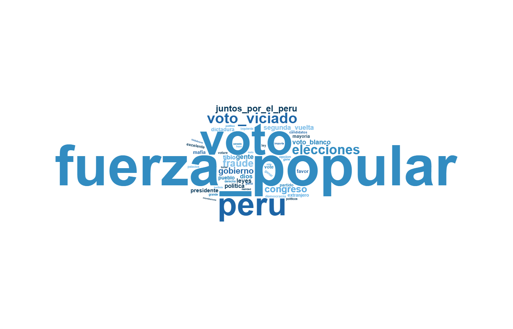

# Aplicación de Text Mining en comentarios de YouTube

El presente documento aplica técnicas de **Text Mining** sobre comentarios públicos extraídos de YouTube. El análisis permite identificar términos frecuentes, referencias partidarias y categorías asociadas al panorama electoral dentro de la conversación digital.

# 1. Preparación del entorno

## 1.1 Limpieza del entorno y carga de paquetes

```{r}
rm(list = ls())
graphics.off()

options(scipen = 999)
options(digits = 3)

if (!require("pacman")) install.packages("pacman")
library(pacman)

p_load(
  tidyverse,
  tidytext,
  readxl,
  stringi,
  wordcloud2,
  htmlwidgets,
  webshot2,
  rstudioapi
)
```

## 1.2 Establecimiento del directorio de trabajo

```{r}
if (rstudioapi::isAvailable()) {
  ruta_script <- tryCatch(
    dirname(rstudioapi::getActiveDocumentContext()$path),
    error = function(e) NA
  )
  
  if (!is.na(ruta_script) && ruta_script != "." && ruta_script != "") {
    setwd(ruta_script)
  }
}

getwd()
```

## 1.3 Configuración de Microsoft Edge para `webshot2`

```{r}
rutas_edge <- c(
  "C:/Program Files (x86)/Microsoft/Edge/Application/msedge.exe",
  "C:/Program Files/Microsoft/Edge/Application/msedge.exe"
)

ruta_edge <- rutas_edge[file.exists(rutas_edge)][1]

if (!is.na(ruta_edge)) {
  Sys.setenv(CHROMOTE_CHROME = ruta_edge)
}
```

# 2. Lectura y selección de datos

## 2.1 Lectura del archivo CSV

```{r}
comentarios_raw <- read_csv(
  "comentarios_youtube_raw.csv",
  show_col_types = FALSE
)

names(comentarios_raw)
```

## 2.2 Selección de la columna de comentarios

```{r}
comentarios_texto <- comentarios_raw %>%
  select(texto_comentario) %>%
  filter(!is.na(texto_comentario)) %>%
  mutate(
    id_comentario = row_number(),
    texto_comentario = str_squish(texto_comentario)
  )

head(comentarios_texto)
```

# 3. Limpieza textual inicial

## 3.1 Normalización previa del texto

```{r}
comentarios_texto <- comentarios_texto %>%
  mutate(
    texto_limpio = texto_comentario,
    texto_limpio = str_to_lower(texto_limpio),
    texto_limpio = stri_trans_general(texto_limpio, "Latin-ASCII"),
    texto_limpio = str_replace_all(texto_limpio, "http\\S+|www\\S+", " "),
    
    texto_limpio = str_replace_all(
      texto_limpio,
      "\\bvoto\\s+viciado\\b|\\bvotos\\s+viciados\\b",
      "voto_viciado"
    ),
    
    texto_limpio = str_replace_all(
      texto_limpio,
      "\\bvoto\\s+en\\s+blanco\\b|\\bvoto\\s+blanco\\b|\\bvotos\\s+blancos\\b",
      "voto_blanco"
    ),
    
    texto_limpio = str_replace_all(
      texto_limpio,
      "\\bsegunda\\s+vuelta\\b|\\b2da\\s+vuelta\\b",
      "segunda_vuelta"
    ),
    
    texto_limpio = str_replace_all(
      texto_limpio,
      "\\bfuerza\\s+popular\\b",
      "fuerza_popular"
    ),
    
    texto_limpio = str_replace_all(
      texto_limpio,
      "\\bjuntos\\s+por\\s+el\\s+peru\\b",
      "juntos_por_el_peru"
    ),
    
    texto_limpio = str_replace_all(texto_limpio, "[^a-z_\\s]", " "),
    texto_limpio = str_squish(texto_limpio)
  )

head(comentarios_texto)
```

## 3.2 Tokenización

```{r}
tokens_comentarios <- comentarios_texto %>%
  select(id_comentario, texto_limpio) %>%
  unnest_tokens(
    output = palabra,
    input = texto_limpio,
    token = "regex",
    pattern = "\\s+"
  )

head(tokens_comentarios, 20)
```

# 4. Eliminación de stopwords

## 4.1 Lectura de stopwords personalizadas

```{r}
stopwords_custom <- read_excel("CustomStopWords.xlsx")

stopwords_custom <- stopwords_custom %>%
  rename(palabra = 1) %>%
  mutate(
    palabra = str_to_lower(palabra),
    palabra = str_squish(palabra),
    palabra = stri_trans_general(palabra, "Latin-ASCII")
  ) %>%
  filter(!is.na(palabra), palabra != "") %>%
  distinct(palabra)

head(stopwords_custom)
```

## 4.2 Limpieza 1: stopwords personalizadas

```{r}
tokens_filtrados <- tokens_comentarios %>%
  mutate(
    palabra = str_to_lower(palabra),
    palabra = str_squish(palabra),
    palabra = stri_trans_general(palabra, "Latin-ASCII")
  ) %>%
  anti_join(stopwords_custom, by = "palabra") %>%
  filter(
    !is.na(palabra),
    palabra != "",
    str_detect(palabra, "^[a-z_]+$")
  )

resumen_limpieza1 <- tibble(
  tokens_iniciales = nrow(tokens_comentarios),
  tokens_despues_stopwords = nrow(tokens_filtrados),
  tokens_eliminados = nrow(tokens_comentarios) - nrow(tokens_filtrados)
)

resumen_limpieza1
```

## 4.3 Stopwords contextuales

```{r}
stopwords_contextuales <- c(
  "castillo",
  "dina",
  "boluarte",
  "vizcarra",
  "sagasti",
  "alan",
  "garcia",
  "toledo",
  "ollanta",
  "humala",
  "acuna",
  "lopez",
  "aliaga",
  "sanchez",
  "nieto",
  "curwen",
  "hildebrandt",
  "marisol",
  "cesar",
  "rosa",
  "tello",
  "chau",
  "rmp",
  "jorge",
  "maria",
  "roberto",
  "perez",
  "lima",
  "sr",
  "sra",
  "senor",
  "senora",
  "gracias",
  "ud",
  "don",
  "jaja",
  "jajaja",
  "xd",
  "xq",
  "q",
  "k",
  "kk",
  "anos",
  "entrevista",
  "tio",
  "persona",
  "seguir",
  "canal",
  "programa"
)

stopwords_contextuales <- tibble(
  palabra = stopwords_contextuales
) %>%
  mutate(
    palabra = str_to_lower(palabra),
    palabra = str_squish(palabra),
    palabra = stri_trans_general(palabra, "Latin-ASCII")
  ) %>%
  distinct(palabra)
```

# 5. Normalización semántica

## 5.1 Diccionario de equivalencias políticas

```{r}
diccionario_equivalencias <- tibble(
  palabra = c(
    "keiko",
    "fujimori",
    "fujimorismo",
    "fujimorista",
    "fujimoristas",
    "fp",
    "fuerza",
    "popular",
    "fuerza_popular",
    
    "jp",
    "juntos",
    "juntos_por_el_peru",
    
    "peru",
    "peruanos",
    "peruanas",
    "peruano",
    "peruana",
    
    "voto",
    "votos",
    "votar",
    
    "viciado",
    "viciados",
    "voto_viciado",
    
    "blanco",
    "blancos",
    "voto_blanco",
    
    "vuelta",
    "segunda_vuelta",
    
    "eleccion",
    "elecciones",
    "electoral",
    "electorales",
    
    "fraude",
    "fraudes",
    "fraudulento",
    "fraudulenta"
  ),
  
  termino = c(
    rep("fuerza_popular", 9),
    rep("juntos_por_el_peru", 3),
    rep("peru", 5),
    rep("voto", 3),
    rep("voto_viciado", 3),
    rep("voto_blanco", 3),
    rep("segunda_vuelta", 2),
    rep("elecciones", 4),
    rep("fraude", 4)
  ),
  
  categoria = c(
    rep("partido_politico", 9),
    rep("partido_politico", 3),
    rep("pais_poblacion", 5),
    rep("tema_electoral", 3),
    rep("tema_electoral", 3),
    rep("tema_electoral", 3),
    rep("tema_electoral", 2),
    rep("tema_electoral", 4),
    rep("riesgo_desinformacion", 4)
  )
) %>%
  mutate(
    palabra = str_to_lower(palabra),
    palabra = str_squish(palabra),
    palabra = stri_trans_general(palabra, "Latin-ASCII")
  )
```

## 5.2 Limpieza final y normalización de términos

```{r}
tokens_final <- tokens_filtrados %>%
  anti_join(stopwords_contextuales, by = "palabra") %>%
  left_join(diccionario_equivalencias, by = "palabra") %>%
  mutate(
    palabra_final = if_else(is.na(termino), palabra, termino),
    categoria = if_else(is.na(categoria), "termino_general", categoria)
  ) %>%
  select(
    id_comentario,
    palabra_original = palabra,
    palabra_final,
    categoria
  )

resumen_limpieza2 <- tibble(
  tokens_despues_stopwords = nrow(tokens_filtrados),
  tokens_finales = nrow(tokens_final),
  tokens_eliminados_limpieza_contextual = nrow(tokens_filtrados) - nrow(tokens_final)
)

resumen_limpieza2

head(tokens_final, 20)
```

# 6. Análisis de frecuencia

## 6.1 Frecuencia general

```{r}
frecuencia_general <- tokens_final %>%
  count(palabra_final, sort = TRUE)

head(frecuencia_general, 20)
```

## 6.2 Top 10 términos más frecuentes

```{r}
top_10_palabras <- tokens_final %>%
  count(palabra_final, sort = TRUE) %>%
  slice_max(n, n = 10, with_ties = FALSE)

top_10_palabras
```

## 6.3 Gráfico del top 10 de términos

```{r}
grafico_top10 <- ggplot(
  top_10_palabras,
  aes(x = reorder(palabra_final, n), y = n, fill = palabra_final)
) +
  geom_col(width = 0.75) +
  coord_flip(clip = "off") +
  geom_text(
    aes(label = n),
    hjust = -0.2,
    colour = "black",
    size = 3.5
  ) +
  labs(
    title = "Top 10 términos más frecuentes en comentarios de YouTube",
    subtitle = "Términos agrupados mediante normalización semántica",
    x = "Término",
    y = "Frecuencia"
  ) +
  scale_y_continuous(
    limits = c(0, max(top_10_palabras$n) + 10),
    expand = c(0, 0)
  ) +
  theme_bw() +
  theme(
    legend.position = "none",
    plot.title = element_text(size = 15, face = "bold", hjust = 0.5),
    plot.subtitle = element_text(size = 10, hjust = 0.5),
    axis.title.x = element_text(size = 10),
    axis.title.y = element_text(size = 10),
    axis.text.x = element_text(color = "gray25", size = 8),
    axis.text.y = element_text(color = "blue4", size = 9, face = "bold"),
    axis.ticks = element_line(color = "lightblue"),
    panel.background = element_rect(fill = "khaki1", color = NA),
    plot.background = element_rect(fill = "white", color = NA),
    panel.grid.major.y = element_blank(),
    panel.grid.minor = element_blank(),
    plot.margin = margin(10, 30, 10, 10)
  )

grafico_top10

```

# 7. Análisis por categorías

## 7.1 Frecuencia por categoría

```{r}
frecuencia_categorias <- tokens_final %>%
  count(categoria, sort = TRUE)

frecuencia_categorias
```

## 7.2 Referencias partidarias

```{r}
frecuencia_partidos <- tokens_final %>%
  filter(categoria == "partido_politico") %>%
  count(palabra_final, sort = TRUE)

frecuencia_partidos
```

## 7.3 Gráfico de referencias partidarias

```{r}
if (nrow(frecuencia_partidos) > 0) 
  
  grafico_partidos <- ggplot(
    frecuencia_partidos,
    aes(x = reorder(palabra_final, n), y = n, fill = palabra_final)
  ) +
    geom_col(width = 0.75) +
    coord_flip(clip = "off") +
    geom_text(
      aes(label = n),
      hjust = -0.2,
      colour = "black",
      size = 3.5
    ) +
    labs(
      title = "Referencias partidarias en comentarios de YouTube",
      subtitle = "Términos agrupados por partido político",
      x = "Partido político",
      y = "Frecuencia"
    ) +
    scale_y_continuous(
      limits = c(0, max(frecuencia_partidos$n) + 10),
      expand = c(0, 0)
    ) +
    theme_bw() +
    theme(
      legend.position = "none",
      plot.title = element_text(size = 15, face = "bold", hjust = 0.5),
      plot.subtitle = element_text(size = 10, hjust = 0.5),
      axis.text.y = element_text(color = "blue4", size = 9, face = "bold"),
      panel.background = element_rect(fill = "khaki1", color = NA),
      panel.grid.major.y = element_blank(),
      panel.grid.minor = element_blank(),
      plot.margin = margin(10, 30, 10, 10)
    )
  
  grafico_partidos

```

## 8. Nube de palabras

```{r}
#| echo: false

frecuencia_palabras <- tokens_final %>%
  count(palabra_final, sort = TRUE) %>%
  slice_max(n, n = 50, with_ties = FALSE)

frecuencia_palabras
```

```{r}
#| echo: false
#| fig-align: center
#| fig-cap: "Nube de palabras generada a partir de la frecuencia de términos normalizados."
#| out-width: "85%"


```

# 9. Análisis de sentimientos

En esta sección se utiliza el diccionario `sentimientos_2.txt`, el cual contiene las columnas `palabra` y `sentimiento`. El análisis identifica los cinco sentimientos más frecuentes en los comentarios de YouTube, ordenados de forma decreciente según su frecuencia.

## 9.1 Lectura del diccionario de sentimientos

```{r}
diccionario_sentimientos <- read_delim(
  "sentimientos_2.txt",
  delim = "\t",
  show_col_types = FALSE
)

diccionario_sentimientos <- diccionario_sentimientos %>%
  mutate(
    palabra = str_to_lower(palabra),
    palabra = str_squish(palabra),
    palabra = stri_trans_general(palabra, "Latin-ASCII"),
    
    sentimiento = str_to_lower(sentimiento),
    sentimiento = str_squish(sentimiento),
    sentimiento = stri_trans_general(sentimiento, "Latin-ASCII")
  ) %>%
  filter(
    !is.na(palabra),
    palabra != "",
    !is.na(sentimiento),
    sentimiento != ""
  ) %>%
  distinct(palabra, sentimiento)

diccionario_sentimientos
```

## 9.2 Cruce entre tokens y diccionario de sentimientos

```{r}
tokens_sentimientos <- tokens_final %>%
  left_join(
    diccionario_sentimientos %>%
      rename(sentimiento_original = sentimiento),
    by = c("palabra_original" = "palabra")
  ) %>%
  left_join(
    diccionario_sentimientos %>%
      rename(sentimiento_final = sentimiento),
    by = c("palabra_final" = "palabra")
  ) %>%
  mutate(
    sentimiento = coalesce(sentimiento_original, sentimiento_final),
    palabra_detectada = if_else(
      !is.na(sentimiento_original),
      palabra_original,
      palabra_final
    )
  ) %>%
  filter(!is.na(sentimiento)) %>%
  select(
    id_comentario,
    palabra_original,
    palabra_final,
    palabra_detectada,
    sentimiento
  ) %>%
  distinct(
    id_comentario,
    palabra_detectada,
    sentimiento,
    .keep_all = TRUE
  )

tokens_sentimientos
```

## 9.3 Frecuencia general de sentimientos

```{r}
frecuencia_sentimientos <- tokens_sentimientos %>%
  count(sentimiento, sort = TRUE) %>%
  mutate(
    porcentaje = round(100 * n / sum(n), 1)
  )

frecuencia_sentimientos
```

## 9.4 Cinco sentimientos más frecuentes

```{r}
top_5_sentimientos <- frecuencia_sentimientos %>%
  slice_max(n, n = 5, with_ties = FALSE) %>%
  arrange(desc(n))

top_5_sentimientos
```

## 9.5 Gráfico de los cinco sentimientos más frecuentes

```{r}
grafico_top5_sentimientos <- ggplot(
  top_5_sentimientos,
  aes(x = reorder(sentimiento, porcentaje), y = porcentaje, fill = sentimiento)
) +
  geom_col(width = 0.75) +
  coord_flip(clip = "off") +
  geom_text(
    aes(label = paste0(porcentaje, "%")),
    hjust = -0.1,
    colour = "black",
    size = 3.5
  ) +
  labs(
    title = "Top 5 sentimientos más frecuentes en comentarios de YouTube",
    subtitle = "Distribución porcentual según el diccionario sentimientos_2.txt",
    x = "Sentimiento",
    y = "Porcentaje"
  ) +
  scale_y_continuous(
    limits = c(0, max(top_5_sentimientos$porcentaje) + 5),
    expand = c(0, 0),
    labels = function(x) paste0(x, "%")
  ) +
  theme_bw() +
  theme(
    legend.position = "none",
    
    plot.title = element_text(
      size = 15,
      face = "bold",
      hjust = 0.5
    ),
    
    plot.subtitle = element_text(
      size = 10,
      hjust = 0.5
    ),
    
    axis.title.x = element_text(size = 10),
    axis.title.y = element_text(size = 10),
    
    axis.text.x = element_text(
      color = "gray25",
      size = 8
    ),
    
    axis.text.y = element_text(
      color = "blue4",
      size = 9,
      face = "bold"
    ),
    
    axis.ticks = element_line(color = "lightblue"),
    
    panel.background = element_rect(
      fill = "khaki1",
      color = NA
    ),
    
    plot.background = element_rect(
      fill = "white",
      color = NA
    ),
    
    panel.grid.major.y = element_blank(),
    panel.grid.minor = element_blank(),
    
    plot.margin = margin(10, 35, 10, 10)
  )

grafico_top5_sentimientos
```

## 9.6 Palabras asociadas a los cinco sentimientos más frecuentes

```{r}
palabras_top5_sentimientos <- tokens_sentimientos %>%
  semi_join(
    top_5_sentimientos,
    by = "sentimiento"
  ) %>%
  count(sentimiento, palabra_detectada, sort = TRUE) %>%
  group_by(sentimiento) %>%
  slice_max(n, n = 10, with_ties = FALSE) %>%
  ungroup()

palabras_top5_sentimientos
```

## 9.7 Gráfico de palabras asociadas por sentimiento

```{r}
grafico_palabras_sentimientos <- ggplot(
  palabras_top5_sentimientos,
  aes(
    x = reorder_within(palabra_detectada, n, sentimiento),
    y = n,
    fill = sentimiento
  )
) +
  geom_col(width = 0.75) +
  coord_flip() +
  facet_wrap(
    ~ sentimiento,
    scales = "free_y"
  ) +
  scale_x_reordered() +
  labs(
    title = "Palabras más frecuentes asociadas a los cinco sentimientos principales",
    subtitle = "Frecuencia de términos detectados mediante el diccionario sentimientos_2.txt",
    x = "Palabra",
    y = "Frecuencia"
  ) +
  theme_bw() +
  theme(
    legend.position = "none",
    
    plot.title = element_text(
      size = 15,
      face = "bold",
      hjust = 0.5
    ),
    
    plot.subtitle = element_text(
      size = 10,
      hjust = 0.5
    ),
    
    axis.text.y = element_text(
      color = "blue4",
      size = 8,
      face = "bold"
    ),
    
    panel.background = element_rect(
      fill = "khaki1",
      color = NA
    ),
    
    plot.background = element_rect(
      fill = "white",
      color = NA
    ),
    
    panel.grid.major.y = element_blank(),
    panel.grid.minor = element_blank()
  )

grafico_palabras_sentimientos

```
